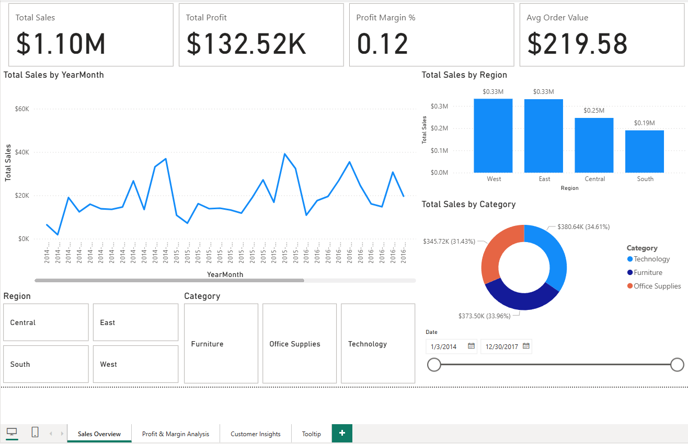
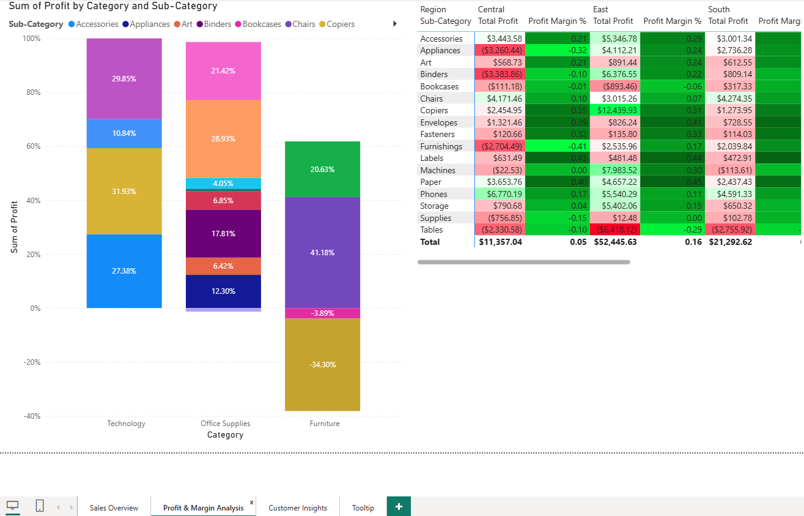
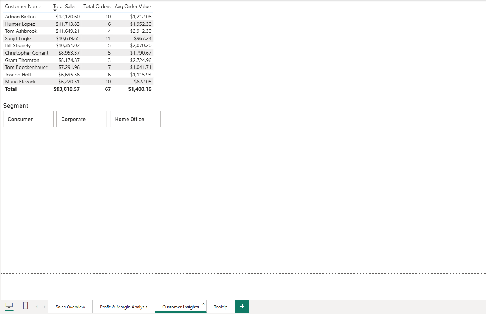
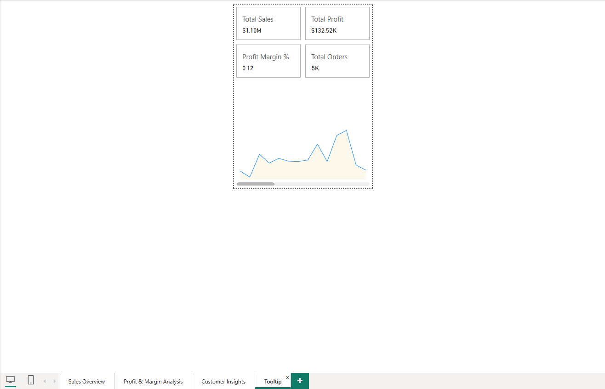

# Superstore Sales & Customer Insights Dashboard

## 📖 Overview
- This project analyzes retail sales data from a fictional Superstore to uncover trends in revenue, profitability, and customer behavior.
- The interactive Power BI dashboard highlights performance by region, product category, and customer segment, helping decision-makers identify growth opportunities and underperforming areas.
---

## 🎯 Objectives
- Identify top-performing regions, categories, and customer segments
- Analyze profit margins across product categories
- Track monthly sales trends and seasonality
- Provide actionable insights for improving sales strategy

---

## 📊 Dataset
- **Source:** [Superstore Dataset][https://www.kaggle.com/datasets/vivek468/superstore-dataset-final]  
- **Size:** 9,800 rows × 21 columns
- **Description:** Includes order details (date, category, sub-category), sales, profit, discount, quantity, shipping info, and customer details.
---

## 🛠️ Tools & Skills
- **Languages/Tech:** Power BI
- **Skills Demonstrated:**
  - Data cleaning and transformation in Power Query
  - KPI creation (Total Sales, Total Profit, Profit Margin)
  - DAX for calculated measures
  - Interactive dashboards with slicers & drill-throughdata cleaning, visualization, dashboarding, reporting, ML basics, etc.  

---

## 📊 Dashboard Preview
- **Page 1 - Sales Overview**
  

  
- **Page 2 - Profit & Margin Analysis**
  

  
- **Page 3 - Customer Insights**
  

  
- **Page 4 - Tooltip**
  
